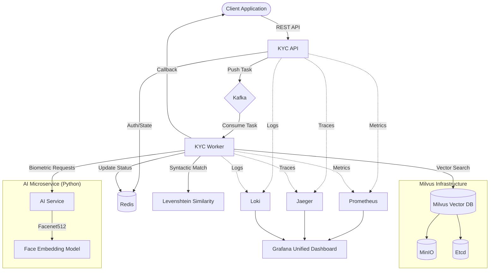

# GoVerify Engine 🛡️

[](https://go.dev/)
[](https://milvus.io/)
[](https://kafka.apache.org/)
[](LICENSE)

**GoVerify Engine** is a state-of-the-art, AI-powered identity verification (KYC) system designed for extreme scalability and precision. It leverages high-fidelity facial biometrics, semantic name matching, and a distributed event-driven architecture to provide instant, reliable Re-KYC capabilities.

---

## 🚀 Key Features

- **Biometric Identity**: DeepFace-powered facial embeddings (Facenet512) for high-precision matching.
- **Semantic Verification**: Hybrid matching combining biometric similarity with syntactic (Levenshtein) name analysis.
- **Event-Driven Scaling**: Kafka-backed asynchronous processing to handle massive request spikes.
- **Ultra-Fast Search**: Milvus Vector DB for sub-millisecond retrieval across millions of identities.
- **Comprehensive Observability**: Native integration with Prometheus, Grafana, Jaeger, and Loki for full-stack visibility.
- **Enterprise Ready**: Built with `uber-go/fx` for clean dependency injection and modularity.

---

## 🏗️ System Architecture

The following diagram illustrates the high-concurrency architecture of the GoVerify Engine:



---

## 🛠️ Tech Stack

| Category | Technology |
| :--- | :--- |
| **Core** | Golang 1.25, Python 3.10 |
| **Frameworks** | Gin (Go), Flask (Python), Uber-fx |
| **Messaging** | Apache Kafka |
| **Databases** | Milvus (Vector), Redis (Cache/Status) |
| **AI/ML** | DeepFace, Facenet512 |
| **Observability** | Prometheus, Grafana, Jaeger, Loki |
| **Infrastructure** | Docker, Kubernetes, Helm |

---

## 🚦 Getting Started

### Prerequisites

- Docker & Docker Compose
- Go 1.25+ (for local development)
- Python 3.10+ (for AI service development)

### Quick Start (Local Deployment)

1. **Clone the repository**:
   ```bash
   git clone https://github.com/vk1033/goverify-engine.git
   cd goverify-engine
   ```

2. **Spin up the infrastructure**:
   ```bash
   docker-compose up -d
   ```
   *This starts the API, Worker, AI Service, Kafka, Milvus, Redis, and the Observability stack.*

3. **Verify Health**:
   - API: [http://localhost:8080/health](http://localhost:8080/health)
   - Swagger: [http://localhost:8080/swagger/index.html](http://localhost:8080/swagger/index.html)
   - Grafana: [http://localhost:3001](http://localhost:3001)

---

## 📖 API Reference

Detailed API documentation is available via Swagger at `/swagger/index.html`.

### Enrollment
`POST /kyc/enroll`
Registers a new identity with a photo and demographic data.

### Verification
`POST /kyc/verify`
Performs a Re-KYC check against existing identities using biometric and semantic matching.

### Search
`GET /kyc/search`
Query identities using metadata filters.

---

## 📊 Observability & Monitoring

GoVerify is built for production reliability. Monitor your cluster using the following dashboards:

- **Grafana**: Unified view of metrics, logs, and traces.
- **Jaeger**: Trace requests across the API, Worker, and AI Service to find bottlenecks.
- **Prometheus**: Real-time service metrics (request rates, error rates, processing latency).
- **Loki**: Centralized log exploration.

---

## 🛡️ Security

- **Data Privacy**: Sensitive demographic data is hashed using Argon2 and PII is encrypted at rest using AES-256 GCM.
- **Authentication**: JWT-based secure access for all API endpoints.
- **Resilience**: Kafka buffering ensures no identity data is lost even during high traffic or worker downtime.

---

## 🤝 Contributing

We welcome contributions! Please see our [CONTRIBUTING.md](CONTRIBUTING.md) for details.

## 📄 License

This project is licensed under the MIT License - see the [LICENSE](LICENSE) file for details.
