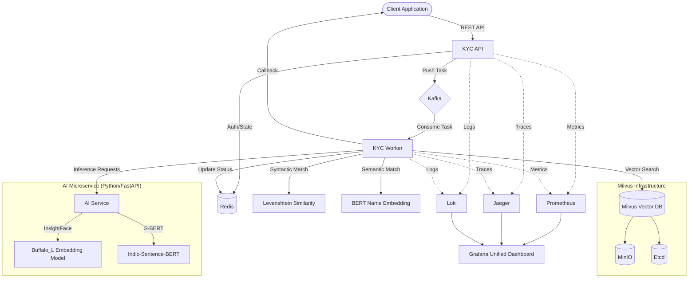

# GoVerify Engine 🛡️

[](https://go.dev/)
[](https://milvus.io/)
[](https://kafka.apache.org/)
[](LICENSE)

**GoVerify Engine** is a state-of-the-art, AI-powered identity verification (KYC) system designed for extreme scalability and precision. It leverages high-fidelity facial biometrics, semantic name matching, and a distributed event-driven architecture to provide instant, reliable Re-KYC capabilities.

---

## 🚀 Key Features

- **Biometric Identity**: InsightFace-powered facial embeddings (`buffalo_l`) for high-precision matching.
- **Semantic Verification**: Hybrid matching combining biometric similarity with BERT-based semantic analysis and Levenshtein syntactic checks.
- **Production-Ready Deployment**: Automated Kubernetes orchestration via **Helm** with resource limits and health checks.
- **Optimized AI Service**: Multi-stage Docker builds with pre-downloaded models for lightning-fast container startup.
- **Event-Driven Scaling**: Kafka-backed asynchronous processing to handle massive request spikes.
- **Ultra-Fast Search**: Milvus Vector DB for sub-millisecond retrieval across millions of identities.
- **Comprehensive Observability**: Native integration with Prometheus, Grafana, Jaeger, and Loki for full-stack visibility.
- **Enterprise Ready**: Built with `uber-go/fx` for clean dependency injection and modularity.

---

## 🏗️ System Architecture

The following diagram illustrates the high-concurrency architecture of the GoVerify Engine:



---

## 🛠️ Tech Stack

| Category | Technology |
| :--- | :--- |
| **Core** | Golang 1.25, Python 3.12 |
| **Frameworks** | Gin (Go), FastAPI (Python), Uber-fx |
| **Messaging** | Apache Kafka |
| **Databases** | Milvus (Vector), Redis (Cache/Status) |
| **AI/ML** | InsightFace (Biometrics), BERT (Names) |
| **Observability** | Prometheus, Grafana, Jaeger, Loki |
| **Infrastructure** | Docker, Kubernetes, Helm |

---

## 🚦 Getting Started

### Prerequisites

- **Kubernetes Cluster** (e.g., Docker Desktop K8s, Minikube, or GKE)
- **Helm 3**
- **Go 1.25+** & **Python 3.12+** (for local development)
- **Docker** (to build images)

### Deployment (Kubernetes)

We provide a professional `Makefile` to manage the entire lifecycle.

1. **Clone the repository**:
   ```bash
   git clone https://github.com/vk1033/goverify-engine.git
   cd goverify-engine
   ```

2. **Build optimized images**:
   ```bash
   # AI models are pre-cached during build
   make build
   ```

3. **Deploy to Kubernetes via Helm**:
   ```bash
   make deploy
   ```

4. **Verify System Status**:
   ```bash
   make status
   ```

---

## 🔗 Service Endpoints

Once deployed, access the system interfaces via the following local endpoints:

| Service | Interface | URL |
| :--- | :--- | :--- |
| **KYC API** | Swagger Documentation | [http://localhost:8080/swagger/index.html](http://localhost:8080/swagger/index.html) |
| **Grafana** | Monitoring Dashboards | [http://localhost:3000](http://localhost:3000) |
| **Jaeger** | Distributed Tracing | [http://localhost:16686](http://localhost:16686) |
| **Prometheus** | Metric Explorer | [http://localhost:9090](http://localhost:9090) |

*Note: If using Minikube or a remote cluster, replace `localhost` with your cluster's LoadBalancer IP.*


---

## 🛠️ Management & Automation

The included `Makefile` provides a standardized interface for common tasks:

| Command | Description |
| :--- | :--- |
| `make build` | Builds all Docker images (optimized for size and speed). |
| `make deploy` | Installs/Upgrades the Helm chart and waits for system readiness. |
| `make status` | Displays Kubernetes pod status and service endpoints. |
| `make logs` | Tails the logs for the KYC API service. |
| `make test` | Runs end-to-end validation of the AI service scoring. |
| `make clean` | Uninstalls the Helm release. |

---

## 📊 Observability & Monitoring

GoVerify provides deep visibility into your identity cluster. Access the dashboards at `http://localhost:3000` (default):

- **Home Dashboard**: High-level overview of system health and throughput.
- **K8s Cluster Dashboard**: Detailed resource usage for Kubernetes pods.
- **Jaeger Tracing**: Trace verification requests across microservices to identify bottlenecks.
- **Loki Logging**: Centralized log exploration for debugging and auditing.

---

## 🛡️ Security & Resilience

- **AI Model Safety**: AI services use CPU-optimized versions of Torch and ONNX Runtime to ensure stability in resource-constrained environments.
- **Data Privacy**: Sensitive demographic data is hashed using Argon2; PII is encrypted at rest using AES-256 GCM.
- **Resilience**: `initContainers` in Helm ensure that critical infrastructure (Kafka, Milvus) is fully ready before application services start.
- **Asynchronous Processing**: Kafka buffering ensures no identity data is lost during traffic spikes or worker maintenance.

---

## 🤝 Contributing

We welcome contributions! Please see our [CONTRIBUTING.md](CONTRIBUTING.md) for details.

## 📄 License

This project is licensed under the MIT License - see the [LICENSE](LICENSE) file for details.

