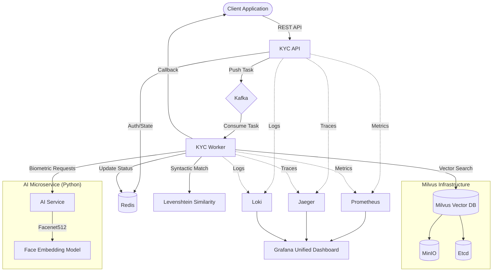

# Architecture Overview

The GoVerify Engine is a high-performance, asynchronous identity verification system designed to handle biometric and semantic matching at scale.

## System Components

### 1. External Interface
- **KYC API (Go/Gin)**: The primary entry point for clients. Handles authentication (JWT), request validation, and asynchronous task orchestration.
- **Swagger UI**: Interactive API documentation.

### 2. Processing Core
- **KYC Worker (Go)**: The background engine that processes verification tasks. It coordinates between the AI service and the vector database. It also performs **Syntactic Name Matching** using Levenshtein distance.
- **AI Service (Python/Flask)**: A specialized service for biometric heavy lifting.
  - **DeepFace**: Generates high-fidelity face embeddings (Facenet512).

### 3. Data & Orchestration
- **Kafka**: The message backbone. Ensures reliability and decoupling between API and Worker.
- **Milvus**: A state-of-the-art vector database for high-dimensional similarity search.
- **Redis**: Fast, in-memory storage for transaction status tracking and temporary state.
- **MinIO**: Object storage used by Milvus for data persistence.
- **Etcd**: Metadata storage for Milvus.

### 4. Observability
- **Prometheus & Grafana**: Real-time metrics and dashboards.
- **Jaeger**: Distributed tracing for identifying bottlenecks across microservices.
- **Loki & Promtail**: Centralized log aggregation.

## Architecture Diagram

## Flow Description

1. **Request**: A client sends a `KYCRequest` (Photo, Name, DOB, etc.) to the `KYC API`.
2. **Acceptance**: The API validates the request, generates a `TransactionID`, stores the initial `PENDING` status in **Redis**, and pushes a message to **Kafka**.
3. **Response**: The API immediately returns the `TransactionID` to the client.
4. **Processing**: The **KYC Worker** picks up the message from Kafka.
5. **Embedding**: The Worker calls the **AI Service** to generate a 512-dimensional vector for the face.
6. **Matching**: The Worker:
   - Queries **Milvus** to find candidates based on face similarity.
   - Calculates **Syntactic Similarity** (Levenshtein) for names in-memory.
   - Computes a final hybrid score (Biometric + Syntactic + Demographic).
7. **Completion**: The Worker updates the transaction status in **Redis** and triggers a webhook callback to the **Client** with the final `VerificationResult`.
